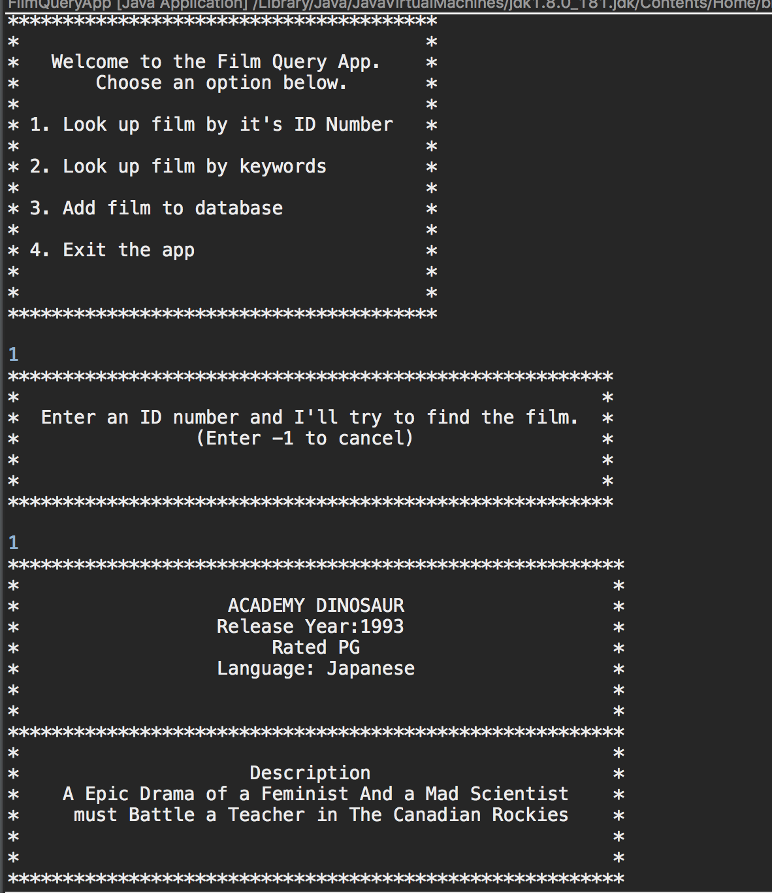

## Week 6 Homework: FilmQuery Project

### Overview
This program was to assigned to test and practice connecting to a database focusing on reading and adding to it using a database accessor object and querying with sql statements and utilizing J Unit test to ensure everything worked properly. 

#### Operation/Description of how the program works:
When program starts, user is prompted with looking up a film from the database with its ID, keywords matching against the title and discription, adding a film to the database or exiting the program. when a film is retrieved, the user has the option to see further details of the film.

#### Technologies/Techniques Used

| Technologies/Techniques |
| ----------------------- |
| Java               |
| MySQL               |
| Maven              |

#### Lessons Learned
- Learning how to properly use mysql and having the correct prepared statements was the most difficult part.

#### Problems/Issues
- I found the logic of my program was not working with making my connections to the DataBase a field of the class, so I changed them to local variables for each relevant method.
 

#### Stretch Goals
- I wanted to add the ability to delete or edit a film but it was not a requirement, so i focused on generally being able to connect to the database